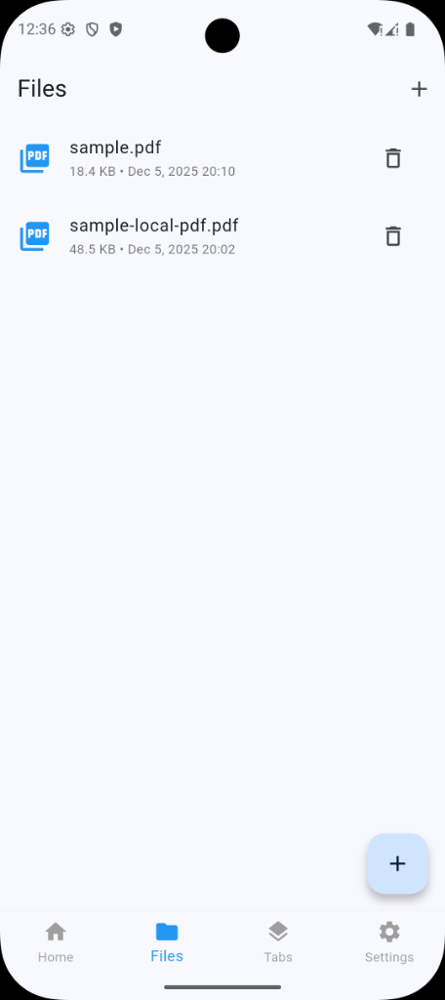
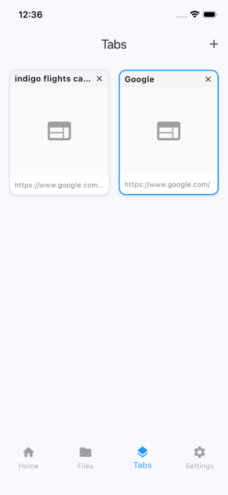
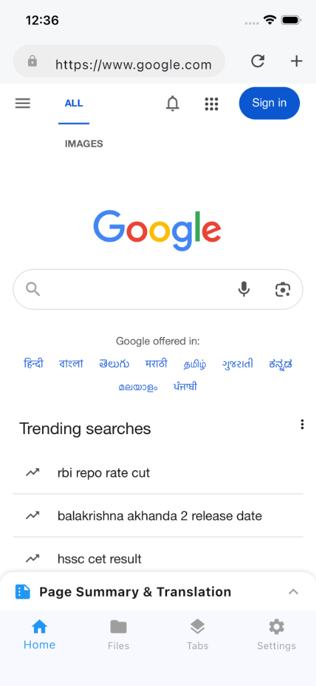
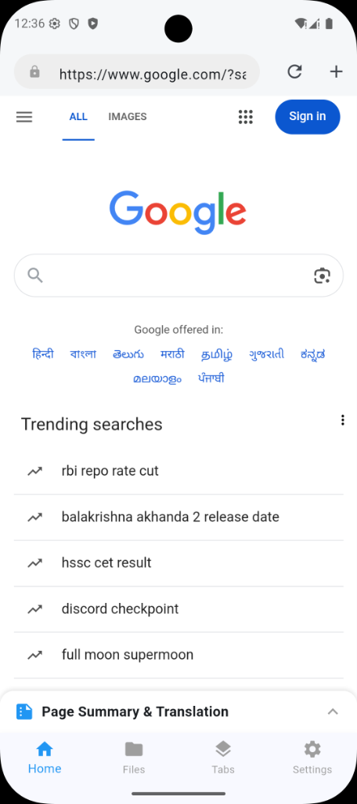

# Smart Flutter Browser

Smart Flutter Browser is a feature-rich mobile web browser built with Flutter. It combines a robust browsing experience with AI-powered utilities, file management, and offline capabilities.

## Features

- **Web Browsing**: Seamless browsing experience powered by `webview_flutter`.
- **AI Assistant**: Integrated AI for page summarization and translation.
- **File Manager**: Built-in file manager to organize downloads and local files.
- **Offline Mode**: Save web pages for offline reading.
- **Download Manager**: Efficiently handle file downloads.
- **Browsing History**: Keep track of your visited sites.

## Tech Stack

- **Framework**: Flutter
- **State Management**: Bloc / Cubit
- **Local Database**: SQFlite
- **Networking**: Dio
- **AI**: dart_openai

## Getting Started

This project is a starting point for a Flutter application.

A few resources to get you started if this is your first Flutter project:

- [Lab: Write your first Flutter app](https://docs.flutter.dev/get-started/codelab)
- [Cookbook: Useful Flutter samples](https://docs.flutter.dev/cookbook)

For help getting started with Flutter development, view the
[online documentation](https://docs.flutter.dev/), which offers tutorials,
samples, guidance on mobile development, and a full API reference.

## Screenshots

| Home Screen | Tabs Screen |
|:---:|:---:|
|  |  |
| **Browser Screen** | **Search Screen** |
|  |  |
